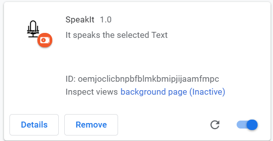
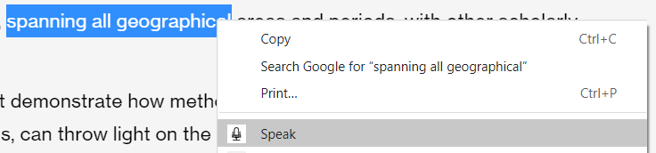

# Speak It Chrome Extension

 A simple chrome extension, to get the idea of basic functionalities. Some extensions doesn't need any browser action extension nor page action extension. 

Speak It is an extension exclusively made to speak up the selected text.
This extension is easy to use in following steps:
- just select the text
- right click on the text 
- select SpeakIt extension 
- It will speak the selected text for you. 

<h3> SpeakIt Extension contains: </h3>
<ul>
<li>manifest.json</li>
<li>eventPage.js</li>
<li>icon image</li>
</ul>
<h3> Here are some demo </h3>

 

<h3> To Run it locally, follow some steps: </h3>
<ul>
<li>Fork and clone the repository.</li>
<li>Go to the "chrome://extensions/"</li>
<li>Turn on the Developer mode option (present at the top right corner).</li>
<li>Click on to the Load unpacked option and select the folder where all the files are present </li>
<li>Now its all set to use it. ENJOY!!</li>
</ul> 

<h4 style="text-align:center"> Made with ❤ <h4>